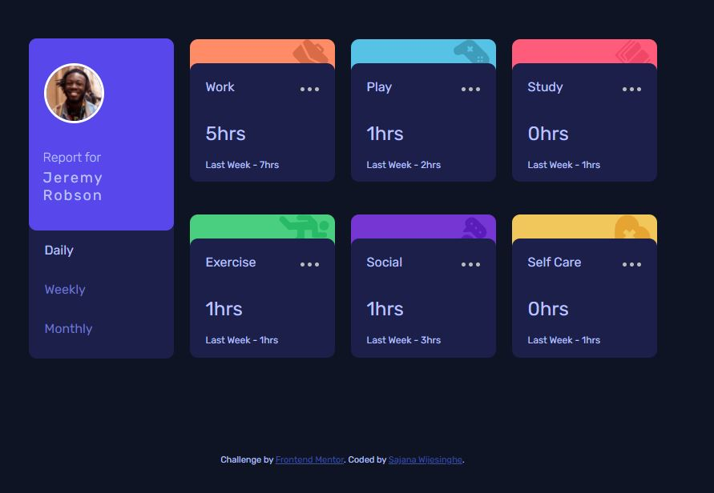
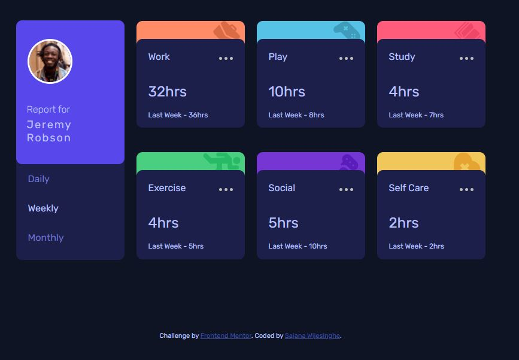
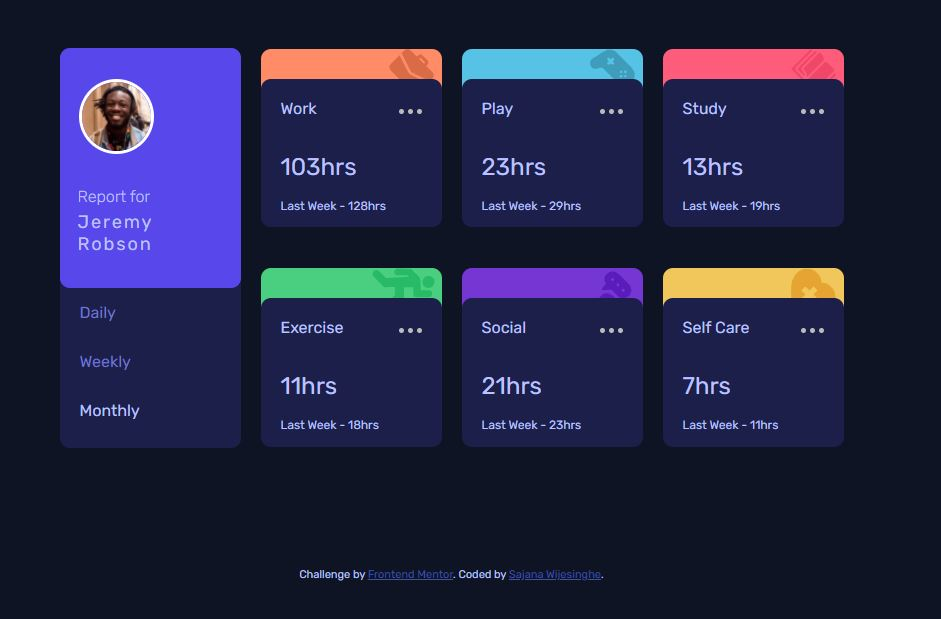

# Frontend Mentor - Time tracking dashboard solution

This is a solution to the [Time tracking dashboard challenge on Frontend Mentor](https://www.frontendmentor.io/challenges/time-tracking-dashboard-UIQ7167Jw). Frontend Mentor challenges help you improve your coding skills by building realistic projects. 

## Table of contents

- [Overview](#overview)
  - [The challenge](#the-challenge)
  - [Screenshot](#screenshot)
  - [Links](#links)
- [My process](#my-process)
  - [Built with](#built-with)
  - [What I learned](#what-i-learned)
- [Author](#author)

## Overview

### The challenge

Users should be able to:

- View the optimal layout for the site depending on their device's screen size
- See hover states for all interactive elements on the page
- Switch between viewing Daily, Weekly, and Monthly stats

### Screenshot

### Links

- Solution URL: [https://github.com/StormKing969/Frontend-Mentor---Time-Tracking-Dashboard](https://github.com/StormKing969/Frontend-Mentor---Time-Tracking-Dashboard)
- Live Site URL: [https://stormking969.github.io/Frontend-Mentor---Time-Tracking-Dashboard/](https://stormking969.github.io/Frontend-Mentor---Time-Tracking-Dashboard/)

## My process

### Built with

- Semantic HTML5 markup
- CSS custom properties
- Flexbox
- CSS Grid
- Mobile-first workflow

### What I learned

Throughout this project, I learned more about fetching data and using that data.

## Author

- Website - [Sajana Wijesinghe](https://sajana-wijesinghe.com)
- Frontend Mentor - [@StormKing969](https://www.frontendmentor.io/profile/StormKing969)
